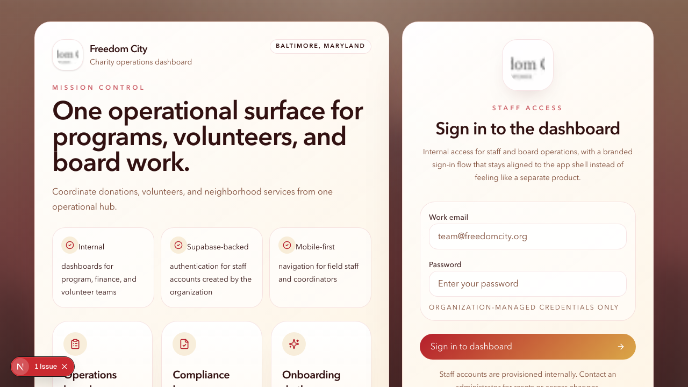
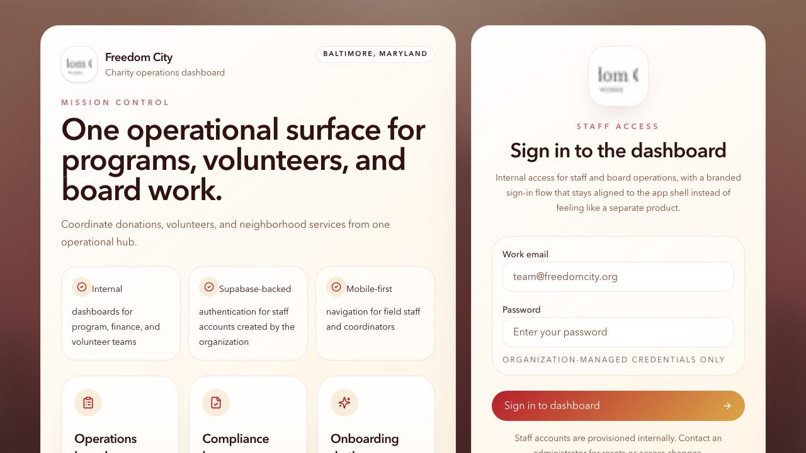
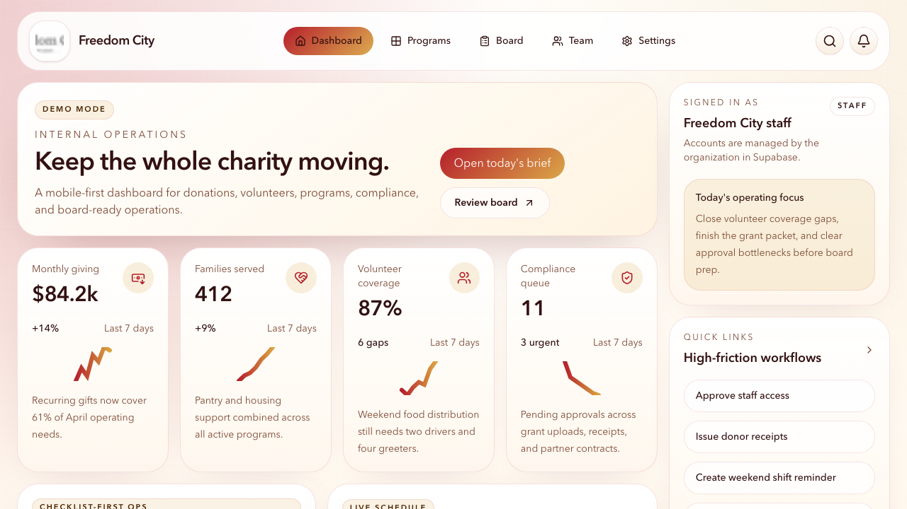
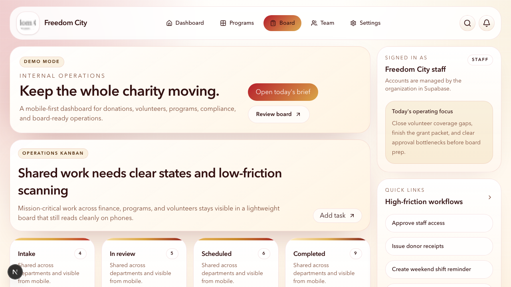

# Freedom City

Freedom City is a mobile-first charity management dashboard built with Next.js, Tailwind CSS, shadcn-style UI primitives, and Supabase-ready authentication.

## What is included

- Staff login surface for organization-managed accounts
- Dashboard cards for fundraising, programs, volunteers, and compliance
- Mobile bottom navigation with desktop shell support
- Lightweight operations board inspired by nonprofit dashboard workflows
- Safe demo mode when Supabase environment variables are not configured

## Local development

```bash
npm install
npm run dev
```

Create a `.env.local` file from `.env.example` when you are ready to connect Supabase:

```bash
NEXT_PUBLIC_SUPABASE_URL=...
NEXT_PUBLIC_SUPABASE_PUBLISHABLE_KEY=...
```

## Verification

```bash
npm run lint
npm run build
```

## Screenshots

### Home


### Login


### App Dashboard


### Board


To refresh screenshots automatically:

```bash
./scripts/update_readme_screenshots.sh
```

## Notes

- The product shape borrows nonprofit ops ideas from the Houdini audit, especially checklist-first onboarding and dashboard density.
- The first version is intentionally compact so it can be extended into real role-based workflows after the initial internal review.
